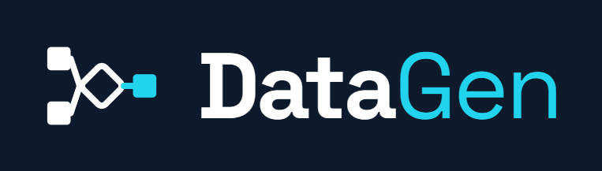
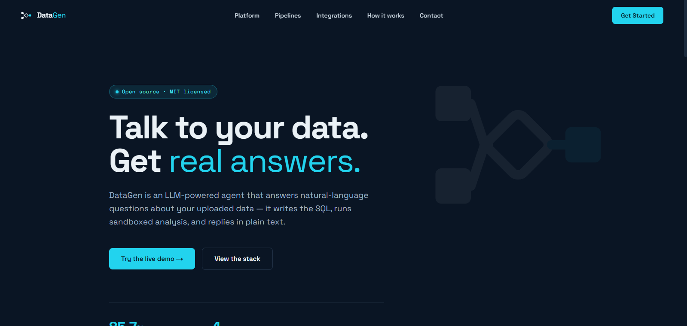
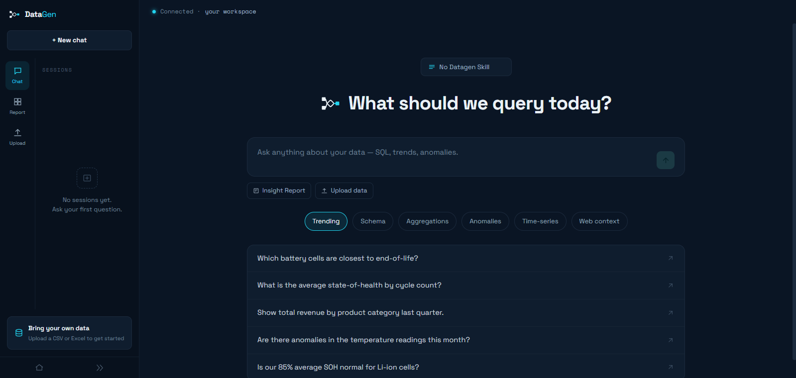

<p align="center">
  
</p>

<p align="center">
  <b>Talk to your data. Get real answers.</b><br>
  Upload a CSV/Excel file and get an autonomous data analyst: auto-profiling,
  natural-language chat over your data, and a one-click AI-written insight report.
</p>

<p align="center">
  
</p>

Architecture, phased implementation plan, and free-tier hosting strategy are
specified in [`DataGenWeb.md`](DataGenWeb.md). This is a from-scratch web
implementation in its own repo — it reuses the **engine** (agent loop, SQL
tools, guardrails, profiler, insight-report pipeline) from the CLI project
([`universal-sql-agent`](https://github.com/juan-elf/Database-AI-agent)), not
its UI (Streamlit isn't Vercel-compatible).

**Status:** live on Vercel (frontend) + Render (backend) + Supabase (Postgres),
all free-tier. Google OAuth login is a planned next step.

```
┌─────────────────────┐     HTTPS / SSE      ┌──────────────────────┐
│  Next.js (Vercel)   │ ──────────────────▶ │  FastAPI backend     │
│  - Upload UI        │                      │  (Railway/Render/Fly)│
│  - Chat (streaming) │ ◀────────────────── │  - reuses DataGen engine
│  - Insight Report    │     JSON / SSE       │  - CSV/Excel ingest  │
└─────────────────────┘                      │  - per-workspace isolation
                                              └──────────┬───────────┘
                                                          │ SQL (schema-per-workspace)
                                                          ▼
                                              ┌────────────────────┐
                                              │ Supabase Postgres  │
                                              └────────────────────┘
```

The chat workspace — sidebar with session history, and a composer that streams
the agent's SQL and answers live:

<p align="center">
  
</p>

## Repo layout

```
DataGen/
├── DataGenWeb.md         # full spec: architecture, phases, free-tier hosting
├── backend/               # FastAPI (Render)
│   ├── core/              # DataGen engine, ported to be workspace-scoped
│   │   ├── context.py      # WorkspaceContext + contextvar plumbing (the P1 isolation layer)
│   │   ├── database.py     # Postgres, schema-per-workspace (was SQLite/global DATABASE_URL)
│   │   ├── agent.py        # agent loop — chat_stream() yields SSE-able events
│   │   ├── tools.py        # execute_sql, get_distinct_values, run_analysis, web_search
│   │   ├── profiler.py     # auto data-profiling, cached per workspace schema
│   │   ├── analysis.py     # sandboxed pandas analysis tool
│   │   ├── insight_report.py  # autonomous multi-step analyst pipeline
│   │   ├── guardrails.py   # prompt-injection defense, trust boundary (unchanged from CLI)
│   │   ├── web_search.py   # Tavily web search (unchanged from CLI)
│   │   ├── logger.py       # per-session JSONL logs
│   │   └── ratelimit.py    # in-memory per-workspace rate limiting
│   ├── ingest/             # CSV/Excel → Postgres table (new — web-only concern)
│   │   ├── loader.py        # file → DataFrame (encoding/row/col/size guardrails)
│   │   ├── schema_infer.py  # column/table name sanitization, type inference
│   │   └── ingest.py        # DataFrame → `<workspace_schema>.<table>` via SQLAlchemy
│   ├── db/                 # workspace identity + lifecycle (new — web-only concern)
│   │   ├── context.py       # get_workspace() — anonymous identity via signed X-Workspace-Id token
│   │   ├── registry.py      # public.datagen_workspaces — tracks every workspace schema
│   │   └── cleanup.py       # TTL sweep — drops idle workspace schemas
│   ├── auth/               # (empty) — reserved for Supabase JWT verification (planned)
│   ├── api/                 # FastAPI routes
│   │   ├── health.py, upload.py, sample.py, chat.py, report.py,
│   │   └── analysis.py, workspace.py (delete-my-data), admin.py
│   ├── samples/            # bundled demo dataset for "Try with sample data"
│   ├── domains/             # domain packs (battery.md, ecommerce.md — from DataGen)
│   ├── tests/               # DB-free unit tests (guardrails, ingest, context, ratelimit)
│   ├── main.py, requirements.txt, Dockerfile, .env.example
├── frontend/               # Next.js App Router (Vercel)
│   ├── app/
│   │   ├── page.tsx          # landing page (design-system marketing page)
│   │   └── (app)/            # authed-app shell: sidebar + session history
│   │       ├── layout.tsx     # sidebar (nav rail, session list, new-chat)
│   │       ├── chat/          # chat UI (SSE), tool activity, SQL blocks
│   │       ├── report/        # insight report (SSE progress + markdown)
│   │       └── upload/        # CSV/Excel upload
│   ├── lib/
│   │   ├── api.ts             # typed client for the backend REST + SSE endpoints
│   │   ├── sse.ts             # hand-rolled SSE frame parser (fetch + ReadableStream)
│   │   └── sessions.tsx       # chat session history store (localStorage, useSyncExternalStore)
│   └── components/            # Logo, Reveal (scroll-reveal)
└── .github/workflows/      # backend tests CI + keep-alive/TTL-sweep cron
```

## Why schema-per-workspace, not a global `DATABASE_URL`

DataGen's CLI engine assumed one process = one database (a global `_db_path` /
`DATABASE_URL`). A web backend serves many users concurrently, so
[`backend/core/context.py`](backend/core/context.py) replaces that global with a
`contextvars.ContextVar` holding a `WorkspaceContext(workspace_id, schema, dsn)`.
`core/database.py`, `core/profiler.py`, etc. call `get_context()` internally —
their function signatures are otherwise unchanged from the CLI version, so the
agent/tools/insight-report code you already know still applies.

Each endpoint (or SSE background thread) explicitly wraps its work in
`with use_context(ctx):` — see the docstring in `core/context.py` for exactly
why this can't be "set once in a FastAPI dependency and left ambient": FastAPI
resolves each sync dependency and the endpoint body via separate threadpool
dispatches, so a contextvar set in one doesn't reliably reach the other, and a
plain generator handed to `StreamingResponse` can resume on a different worker
thread between `yield`s. Both `api/chat.py` and `api/report.py` sidestep this
by running the whole streaming pipeline on one dedicated thread they spawn
themselves, communicating to the HTTP response via a `queue.Queue`.

## Workspace identity (anonymous, cross-site-safe)

Each visitor gets an anonymous workspace — no login. Identity is a **signed
token** the backend issues in the `X-Workspace-Id` response header; the frontend
persists it in `localStorage` and echoes it on every request. Continuing across
requests keeps you in the same `workspace_<id>` schema, so your uploaded tables
are still there.

Why a header and not a cookie: the frontend (Vercel) and backend (Render) live
on **different registrable domains**, so every browser `fetch` is *cross-site*.
A `SameSite=Lax` cookie is never sent on cross-site fetches (in **any** browser,
not just Safari), and a `SameSite=None` third-party cookie is blocked outright
by Safari's ITP — so a cookie can't carry identity here. A header set from
first-party `localStorage` sidesteps all of that and works everywhere. (A cookie
is still set as a bonus, so a future same-site custom-domain deployment keeps
working unchanged.) See `db/context.py`'s docstring for the full rationale and
for how to swap in Supabase Auth later (a planned next step) without touching
anything downstream.

Chat **session history** lives entirely client-side (`lib/sessions.tsx`,
localStorage) — consistent with the browser-local identity model, and requires
no backend/DB changes. Each session is a saved transcript; the backend keeps
the live conversation context only for the currently active session.

## Data handling

A public demo asks strangers to hand over a file, so the app is explicit about
what happens to it — and gives a way to try it without handing over anything:

- **Try without uploading** — `POST /sample` loads a bundled synthetic
  e-commerce dataset (420 orders) into your workspace through the *same* ingest
  pipeline as a real upload, so the demo path can't drift from the real one.
- **Isolation** — data lands in a Postgres schema only your session can query
  (see "Workspace identity" above).
- **Read-only analysis** — the agent's SQL tool is whitelist/blacklist validated
  and runs on a read-only session; it cannot write to your tables.
- **Automatic expiry** — idle workspaces are dropped after `WORKSPACE_TTL_DAYS`
  (default 7) by the cleanup sweep.
- **Immediate deletion** — `DELETE /workspace` drops the caller's schema and
  registry row on demand ("Delete my data" in the sidebar). There is no
  workspace-id parameter: the schema dropped is always derived from the
  caller's own signed token, so it can't be pointed at someone else's data.
- **What leaves the system** — answering a question sends your table structure
  and small result excerpts to the LLM provider (OpenRouter). The UI says this
  plainly rather than implying the data never leaves; if you run this yourself,
  check your provider's data-retention setting, since some free-tier models may
  log or train on inputs.

## Getting started

### Backend

```powershell
cd backend
py -m venv .venv
.\.venv\Scripts\Activate.ps1
pip install -r requirements.txt
copy .env.example .env    # fill in OPENROUTER_API_KEY, DATABASE_URL, SECRET_KEY
uvicorn main:app --reload --port 8000
```

`DATABASE_URL` must point at a Postgres instance (Supabase free tier works).
The read role only needs `CONNECT` + the ability to create/use its own
schemas per workspace — see the "Supabase setup" section below for the exact
grants.

Health check: `GET http://localhost:8000/health` and `/health/db`.

### Frontend

```powershell
cd frontend
npm install
copy .env.example .env.local   # NEXT_PUBLIC_API_URL=http://localhost:8000
npm run dev
```

Opens at http://localhost:3000.

## Supabase setup (production database)

1. Create a free Supabase project.
2. Create two Postgres roles (SQL Editor):
   ```sql
   CREATE ROLE agent_reader LOGIN PASSWORD '...';
   CREATE ROLE agent_writer LOGIN PASSWORD '...' CREATEDB;
   GRANT CREATE, USAGE ON SCHEMA public TO agent_writer;
   ```
   Per-workspace schemas are created dynamically by `ingest/ingest.py` — grant
   `agent_reader` `USAGE` + `SELECT` on new schemas via a default privilege:
   ```sql
   ALTER DEFAULT PRIVILEGES FOR ROLE agent_writer IN SCHEMA public
     GRANT SELECT ON TABLES TO agent_reader;
   ```
   (Adjust per your actual schema-creation role — the goal is: `agent_reader`
   can never `INSERT`/`UPDATE`/`DELETE`/`DROP`, only `SELECT`, mirroring
   DataGen's original read-only enforcement.)
3. Set `DATABASE_URL` (agent_reader) and `WRITE_DATABASE_URL` (agent_writer)
   in `backend/.env`.

## Deploying

Deployed as Vercel (frontend) + Render (backend) + Supabase (Postgres), all
free-tier:

- **Frontend → Vercel**: import the repo with root directory `frontend`, set
  `NEXT_PUBLIC_API_URL` to the deployed backend URL.
- **Backend → Render** (or Fly.io / HF Spaces): build `backend/Dockerfile`.
  Render's free tier sleeps after 15 min idle — `.github/workflows/keepalive.yml`
  pings `/health/db` and triggers `/admin/cleanup` every 10 minutes to prevent
  that and to stop the Supabase free-tier project from pausing after a week
  idle. Set the `BACKEND_URL` and `CLEANUP_TOKEN` repo secrets for it to work.
- **Database → Supabase**: nothing to deploy, just keep it warm (see above). Use
  the **Session pooler** connection string (IPv4, port 5432) — not Direct
  (IPv6-only) or the Transaction pooler (breaks per-request `SET search_path`).
- **CORS/cookies note**: set `FRONTEND_ORIGIN` on the backend to the exact
  Vercel origin, and `COOKIE_SECURE=true` in production (`false` only for local
  HTTP). Cross-site identity rides the `X-Workspace-Id` header, not a cookie
  (see "Workspace identity" above).

## Testing

```powershell
cd backend
pytest -v
```

Covers guardrails, ingest (file loading, schema sanitization/type inference),
the workspace context primitive, and the rate limiter — all DB-free. Anything
touching `core/database.py`/`core/profiler.py` end-to-end needs a real
Postgres connection; exercise those manually against a Supabase dev project
(`DATABASE_URL` in `.env`) since no Postgres is available in CI/this sandbox.

## What's implemented vs. deferred

Phases P0–P4 of [`DataGenWeb.md`](DataGenWeb.md) are done and deployed; P5 is
partially in place (rate limiting, TTL, keep-alive; auth is the remaining piece).

| Done | Deferred |
|---|---|
| Schema-per-workspace isolation (P1) | Google OAuth login via Supabase Auth — planned (workspace is anonymous-only today) |
| CSV/Excel ingest → Postgres (P2) | CSV formula-injection sanitization on **export** (no export feature yet) |
| `/chat`, `/report`, `/analysis` SSE endpoints reusing the DataGen engine (P3) | PDF report export (markdown only) |
| Designed frontend + chat session history (localStorage) | Server-side chat history (sync across devices — pairs with auth) |
| Cross-site-safe workspace identity (header + localStorage) | — |
| Rate limiting (in-memory, per-workspace) | Redis-backed rate limiting (only needed if scaled to >1 backend instance) |
| Workspace TTL sweep + keep-alive cron | Dashboard for viewing/managing your own workspace's tables directly |
